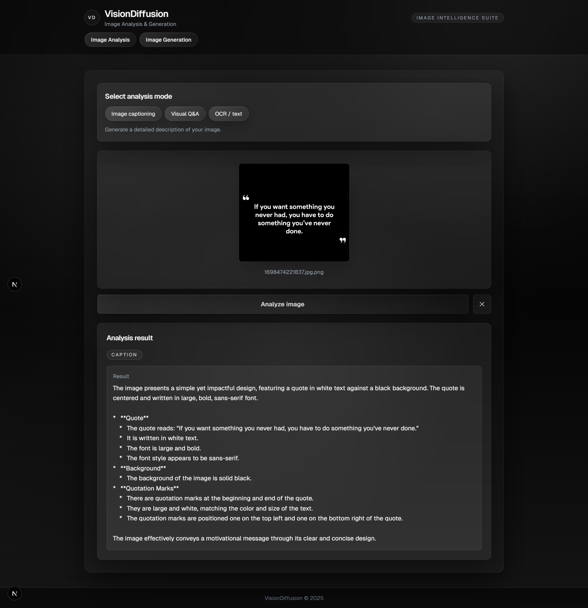
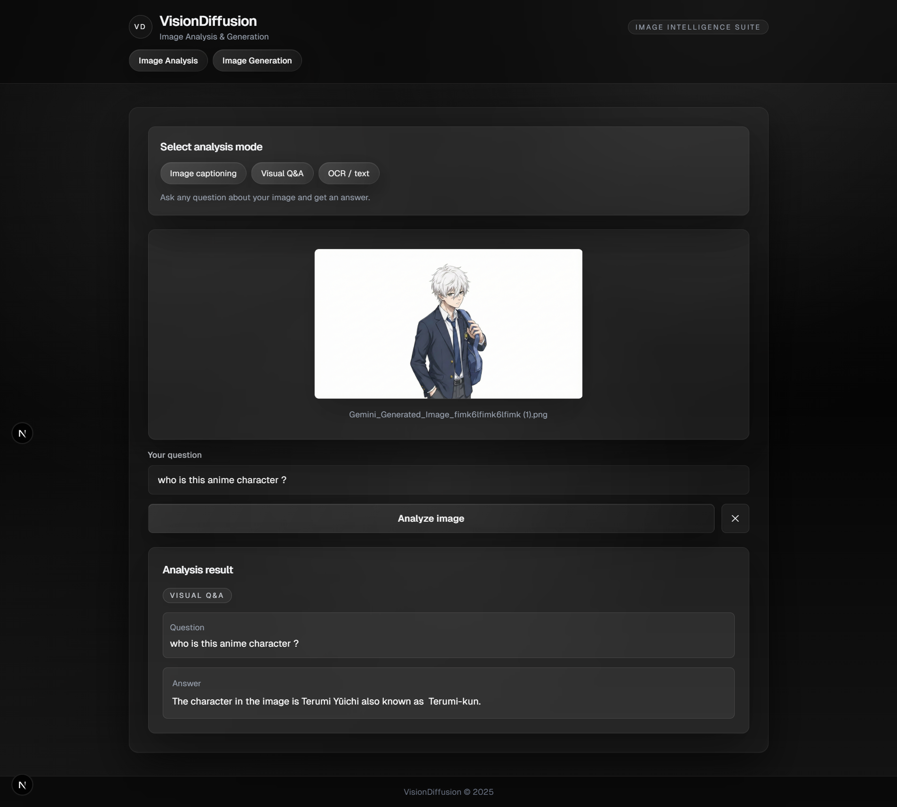
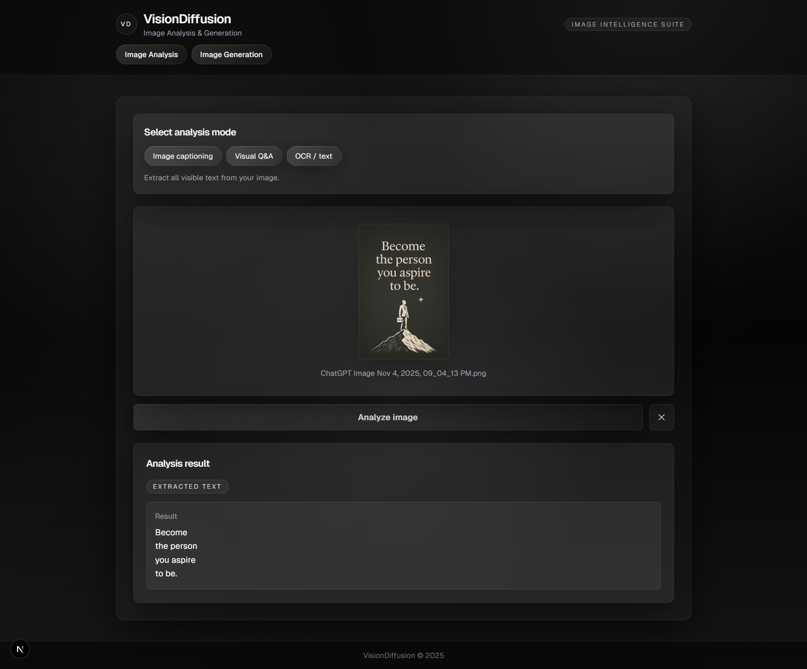
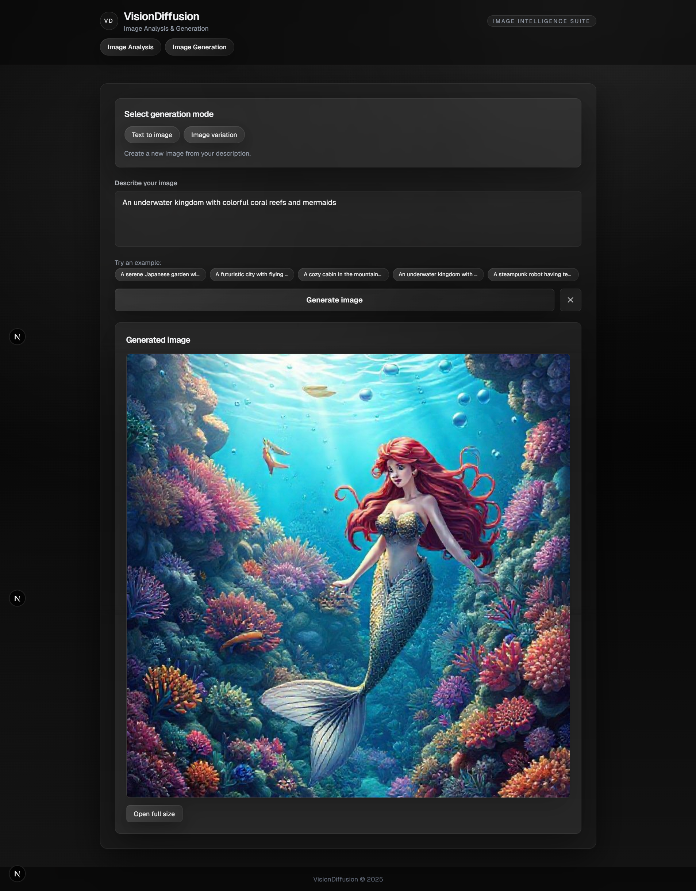
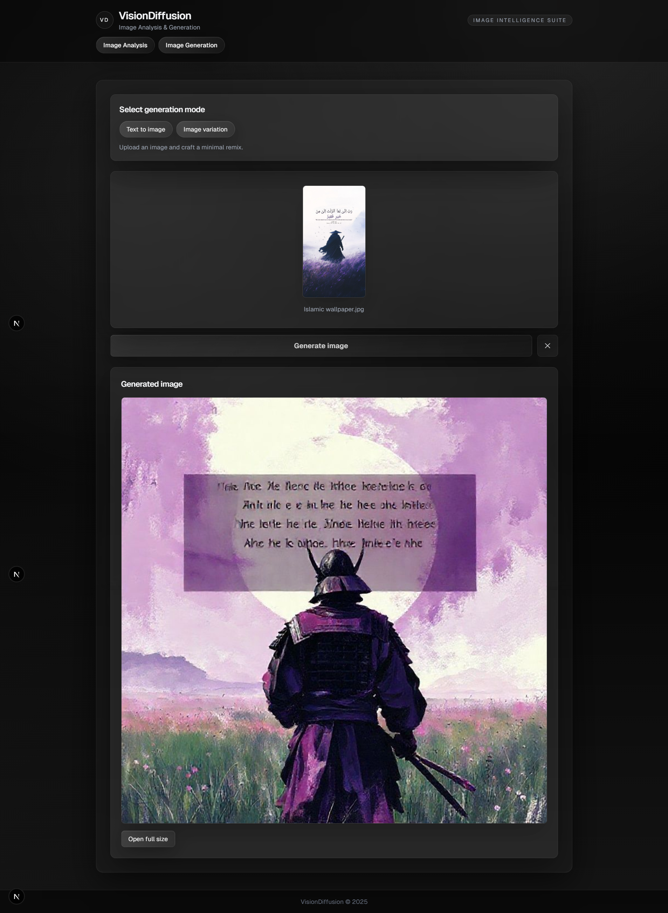

# 📊 Evaluation Document

This document provides screenshots and descriptions for each implemented feature in VisionDiffusion.

---

## 🔍 Image Analysis Features

### 1. Image Captioning

**Description:** Generates a detailed natural language description of an uploaded image using the Groq Llama 4 Scout vision model.

**Input:**
- Upload any image (JPEG, PNG, GIF, WebP supported)
- Select "Image captioning" mode
- Click "Analyze image"

**Screenshot:**



---

### 2. Visual Question Answering (VQA)

**Description:** Answer specific questions about an uploaded image. Users can ask anything from object identification to scene understanding.

**Input:**
- Upload an image
- Select "Visual Q&A" mode
- Enter a question (e.g., "What objects are visible in this image?")
- Click "Analyze image"

**Screenshot:**



---

### 3. OCR / Text Extraction

**Description:** Extracts all visible text from an image, preserving formatting and order. Useful for screenshots, documents, or signs.

**Input:**
- Upload an image containing text
- Select "OCR / text" mode
- Click "Analyze image"

**Screenshot:**



---

## 🎨 Image Generation Features

### 4. Text-to-Image Generation

**Description:** Creates a new image from a text description using the Pollinations Flux model.

**Input:**
- Select "Text to image" mode
- Enter a prompt (e.g., "A futuristic city with flying cars and neon lights at night")
- Click "Generate image"

**Screenshot:**



---

### 5. Image Variation

**Description:** Generates an artistic variation of an uploaded image. The system first describes the original image, then creates a fresh interpretation.

**Input:**
- Select "Image variation" mode
- Upload a source image
- Click "Generate image"

**Screenshot:**



---

## 💾 Data Persistence

### Database Storage (Supabase)

**Description:** All analysis results and generations are automatically saved to Supabase PostgreSQL database.

**Tables:**
- `analyses` - Stores image analysis results (caption, VQA, OCR)
- `generations` - Stores generation results (text-to-image, variations)

---

## 🎯 User Experience Features

### Loading States

The application provides clear visual feedback during API calls:
- Animated spinner during processing
- Status messages like "Analyzing..." or "Generating..."
- Disabled buttons to prevent duplicate submissions

### Error Handling

User-friendly error messages are displayed in red banners when operations fail, helping users understand what went wrong.

---

## ✅ Feature Verification Checklist

| Feature | Implemented | Tested | Screenshot |
|---------|-------------|--------|------------|
| Image Upload (drag-drop + click) | ✅ | ✅ | ✅ |
| Image Captioning | ✅ | ✅ | ✅ |
| Visual Q&A | ✅ | ✅ | ✅ |
| OCR/Text Extraction | ✅ | ✅ | ✅ |
| Text-to-Image | ✅ | ✅ | ✅ |
| Image Variation | ✅ | ✅ | ✅ |
| Database Persistence | ✅ | ✅ | — |
| Loading States | ✅ | ✅ | — |
| Error Handling | ✅ | ✅ | — |

---

## 📁 Screenshots Included

```
screenshots/
├── Image-Analysis_Captioning.png     # Image captioning feature
├── Image-Analysis_VQA.png            # Visual Q&A feature  
├── Image-Analysis_OCR.png            # OCR text extraction
├── Image_Generation_Text-to-image.png # Text-to-image generation
└── Image_Generation_Variation.png    # Image variation generation
```

